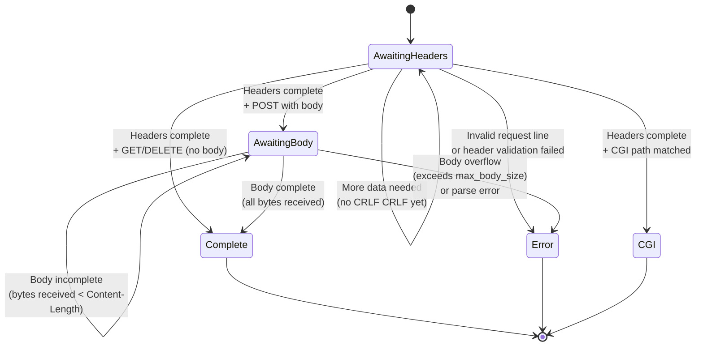
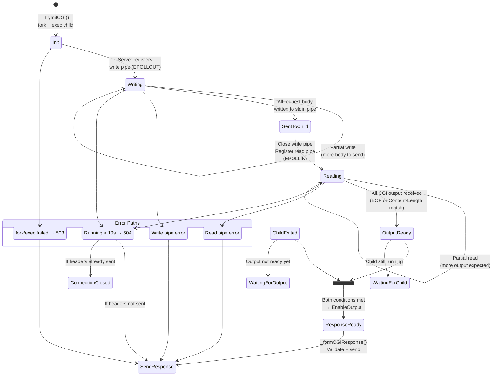
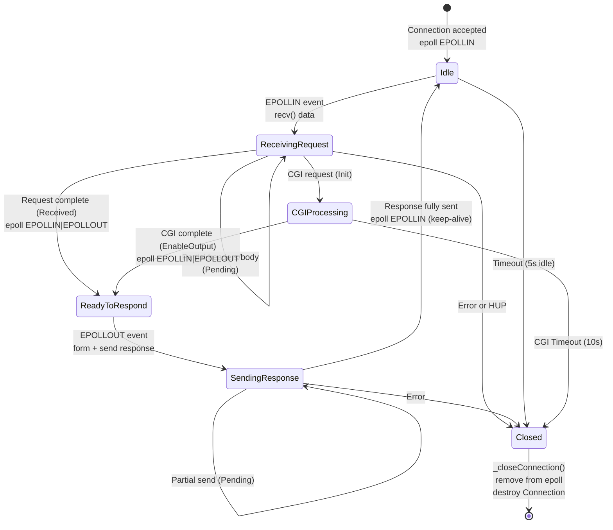

# Webserv — Architecture & Execution Flow

> Complete project diagram: class relationships, execution flow, and state machines.

---

## 1. Class Relationships & Architecture

All classes organized into four layers: **Configuration**, **Socket/Server**, **HTTP Parser**, and **Utility/Enum**.

```mermaid
classDiagram
    direction TB

    %% ═══════════════════════════════════════════
    %% CONFIGURATION LAYER
    %% ═══════════════════════════════════════════

    class ConfigurationFileParser {
        -string _filename
        -ServerBlock _current_server_block
        -server_block_map& _server_blocks
        +ConfigurationFileParser(filename, server_blocks)
        +parse() e_parse_result
        -_parseAllServerBlocks()
        -_parseSingleServerBlock()
        -_dispatchServerDirective()
        -_handleListenDirective()
        -_handleLocationsDirective()
        -_handleCGIDirective()
        -_validateServerBlocks()
    }

    class ServerBlock {
        +string _server_name
        +ListenData _listen_data
        +map~HttpStatus__e_code,string~ _error_pages
        +size_t _max_body_size
        +path _root
        +optional~string~ _index
        +optional~vector~Location~~ _locations
        +optional~vector~CGIPath~~ _cgi
        +bitset~8~ _assigned_fields
    }

    class Location {
        -path path
        -path root
        -bool autoindex
        -string default_file
        -optional~HttpMethodRegistry~ methods_registry
        -HttpPage return_page
        +getters/setters()
        +to_string() string
    }

    class CGIPath {
        +string path
        +unordered_map~string,string~ pass_to
        +string extension
        +optional~HttpMethodRegistry~ methods_registry
    }

    class ListenData {
        +short port
        +string ip_address
        +operator==() bool
    }

    class ListenDataHash {
        +operator()(ListenData) size_t
    }

    class HttpPage {
        +path path
        +HttpStatus__e_code status_code
    }

    ConfigurationFileParser ..> ServerBlock : creates
    ServerBlock *-- ListenData
    ServerBlock *-- "0..*" Location
    ServerBlock *-- "0..*" CGIPath
    ServerBlock ..> HttpPage : error_pages
    Location *-- HttpPage : return_page
    Location *-- HttpMethodRegistry
    CGIPath *-- HttpMethodRegistry
    ListenDataHash ..> ListenData : hashes

    %% ═══════════════════════════════════════════
    %% SOCKET / SERVER LAYER
    %% ═══════════════════════════════════════════

    class Server {
        -CONNECTION_TIMEOUT = 5s
        -CGI_TIMEOUT = 10s
        -connections_map _connections
        -cgi_pipe_fds_set _cgi_pipe_fds
        -fd_to_connection_map _fd_to_connection
        -pid_to_connection_map _pid_to_connection
        -listeners_map _listeners
        -Poller _poller
        -ChildSignalHandler _childHandler
        -server_blocks_map _server_blocks
        +Server(server_block_map)
        +run() void
        -_acceptConnection(fd)
        -_handleEvent(epoll_event)
        -_handleTimeouts()
        -_handleConnectionEvent(IoEvent, fd)
        -_handleCGIEvent(IoEvent, Connection)
        -_handleFinishedChildren()
        -_registerConnectionCGI(Connection, CGIOperation)
        -_unregisterConnectionCGI(Connection, CGIOperation)
        -_closeConnection(fd)
    }

    class Poller {
        -MAX_EVENTS = 1024
        -TIMEOUT = 1000ms
        -int _epoll_fd
        -vector~epoll_event~ _events
        +Poller()
        +wait() int
        +add(fd, events)
        +mod(fd, events)
        +del(fd)
        +getEvent(index) epoll_event
    }

    class Listener {
        -Socket _socket
        +Listener(ip, port)
        +accept() Socket
        +getFD() int
        -getAddresses() AddrInfoPtr
        -setupSocket(addrinfo)
    }

    class Socket {
        -int _fd
        +Socket()
        +Socket(fd)
        +create(addrinfo)
        +setAddressReuse()
        +setDualStack()
        +bind(addrinfo)
        +listen()
        +accept() Socket
        +getFD() int
        +isHealthy() bool
        -_setNonBlocking()
        -_safeClose()
    }

    class Connection {
        -chrono_time _last_activity
        -optional~chrono_time~ _cgi_start_time
        -int _fd
        -Socket _socket
        -optional~CGIHandler~ _cgi_handler
        -ServerBlock* _server_block
        -BufferManager _buffer_manager
        -HttpRequestReader _request_reader
        -HttpResponseWriter _response_writer
        -bool _response_formed
        -bool _headers_sent_to_client
        -ssize_t _sent_bytes
        -ssize_t _read_bytes
        +Connection(ServerBlock*, Socket&&)
        +processConnectionEvents(events) IoResult
        +processCGIEvents(events) IoResult
        +onCGIOutputReady() EventAction
        +onChildProcessExited() EventAction
        +getCGIPID() int
        +getCGIPipe(CGIOperation) int
        +closeCGIPipe(CGIOperation)
        +abortCGI()
        -_receiveData() IoEvent
        -_sendData() IoEvent
        -_formResponse()
        -_formCGIResponse()
        -_tryInitCGI() IoEvent
    }

    class PipeFD {
        -int _fd
        +PipeFD()
        +PipeFD(fd)
        +release() int
        +reset()
        +get() int
        +~PipeFD()
    }

    class ChildSignalHandler {
        -int _sig_fd
        +ChildSignalHandler()
        +getFD() int
        +handleFinishedChildren() vector~pid_t~
        -_readSignalFD()
    }

    class CGIHandler {
        -PIPE_BUFFER_SIZE = 65536
        -int _pid
        -PipeFD _write_fd
        -PipeFD _read_fd
        -size_t _content_length
        -size_t _header_end_offset
        -bool _headers_parsed
        -size_t _write_offset
        -bool _is_output_ready
        -bool _is_child_dead
        -string _recv_buffer
        +CGIHandler(CGIConfig)
        +writeToCGI(buffer) IoEvent
        +readFromCGI() IoEvent
        +isResponseReady() bool
        +onCGIOutputReady() EventAction
        +onChildProcessExited() EventAction
        +getWriteFD() int
        +getReadFD() int
        +closeWritePipe()
        +closeReadPipe()
    }

    class CGIExecutor {
        -int _pid
        -PipeFD _write_pipe[2]
        -PipeFD _read_pipe[2]
        +CGIExecutor(CGIConfig)
        +getPID() int
        +releaseWriteFD() int
        +releaseReadFD() int
        -_initPipes()
        -_initFork()
        -_initChild(CGIConfig)
        -_initChildPipes()
        -_restoreDefaultSignalMask()
        -_generateEnvp(CGIConfig) vector
        -_generateArgv(CGIConfig) vector
    }

    class CGIRequestConfig {
        +buildConfig(headers, file)$ CGIConfig
        -addTargetEnv(envVars, target)$
        -toCGIHeaderName(name)$ string
    }

    Server *-- Poller
    Server *-- ChildSignalHandler
    Server *-- "0..*" Connection : _connections map
    Server *-- "1..*" Listener : _listeners map
    Server o-- ServerBlock : _server_blocks
    Server ..> CGIOperation : uses
    Server ..> IoResult : reads
    Server ..> EventAction : reads
    Listener *-- Socket
    Connection *-- Socket
    Connection *-- BufferManager
    Connection *-- HttpRequestReader
    Connection *-- HttpResponseWriter
    Connection o-- "0..1" CGIHandler : optional
    Connection o-- ServerBlock : references
    Connection ..> IoResult : returns
    Connection ..> CGIRequestConfig : calls buildConfig
    CGIHandler *-- "2" PipeFD : read + write
    CGIHandler ..> CGIExecutor : creates in ctor
    CGIHandler ..> EventAction : returns
    CGIExecutor *-- "4" PipeFD : pipe pairs
    CGIExecutor ..> CGIConfig : reads

    %% ═══════════════════════════════════════════
    %% HTTP PARSER LAYER
    %% ═══════════════════════════════════════════

    class HttpMessage {
        #unordered_map~string,string~ _headers
        #string _body
        +get_headers() map
        +get_header_value(key) string
        +set_header_value(key, value)
        +get_content_length() size_t
        +append_body_value(addition)
        +get_body() string
    }

    class Request {
        -HttpMethod__e_code _method
        -string _version
        -string _uri
        -HttpStatus__e_code _status_code
        -ChunkHandler _chunk_handler
        -bool _is_cgi
        -ServerBlock* _server_block
        -File _file
        +get_method() HttpMethod_e_code
        +get_status_code() HttpStatus_e_code
        +set_status_code(code)
        +getFile() File
        +getBodyStatus() RequestType
        +isCGI() bool
        +reset()
    }

    class Response {
        -HttpStatus__e_code _status_code
        -HttpMethod__e_code _method
        -File _file
        -size_t _response_length
        -streampos _content_length
        -size_t _bytes_sent
        -ssize_t _bytes_read
        -size_t _buffer = 10240
        -bool _is_default_page
        -string _header_str
        +form_response(status, method, file, body, isCGI) string
        +get_total_response_length() size_t
        +getResponseData() char*
        +consume_body(bytes)
        +read_body_partially()
        +set_content_type(filename)
    }

    class HttpRequestReader {
        -Request _request
        -size_t _stored_body_bytes
        -ReaderState _curr_state
        +HttpRequestReader(ServerBlock*)
        +read(buffer, bytes) ReaderState
        +reset()
        +getFile() File
        +getMethod() HttpMethod_e_code
        +getHeaders() map
        +getStatusCode() HttpStatus_e_code
        +setStatusCode(code)
        -_processHeader(buffer) ReaderState
        -_processBody(buffer, bytes) ReaderState
        -_checkHeaderState(buffer) HeaderState
        -_checkBodyState(buffer, bytes) BodyState
    }

    class RequestParser {
        -ParseContext _parse_context
        +RequestParser(Request, buffer)
        +parse_headers()
        +parse_body()
    }

    class RequestLineValidator {
        -ParseContext& _parse_context
        +RequestLineValidator(ParseContext)
        +parse()
        -_isValidRequestLine(buffer) bool
        -_isValidHttpVersion() bool
        -_isValidUriLength() bool
        -_isMethodAllowed() bool
        -_isRequestTargetInConfigFile(target) e_parse_result
    }

    class HttpHeaderParser {
        -ParseContext& _parse_context
        +HttpHeaderParser(ParseContext)
        +parse()
        -_validateRequestHeaders() HttpStatus_e_code
        -_isValidHeader(buffer) bool
        -_contentLengthValidation() HttpStatus_e_code
    }

    class HttpBodyParser {
        -ParseContext& _parse_context
        -vector~MultipartFormData~ _multipartFormDatas
        +HttpBodyParser(ParseContext)
        +parse()
        -_handleChunked()
        -_handleMultipart()
        -_handleRawUpload()
    }

    class BufferManager {
        -READ_BUFFER_SIZE = 32768
        -string _read_buffer
        -char* _recv_buffer
        +BufferManager()
        +getRecvBuffer() char*
        +getReceiveBufferSize() size_t
        +append(bytes)
        +consume(bytes)
        +clear()
        +getBuffer() string
    }

    class HttpResponseWriter {
        -Response _response
        +formResponse(status, method, file, buffer, isCGI)
        +write()
        +totalLength() size_t
        +currResponseLength() size_t
        +getResponseData() char*
        +consume(bytes)
    }

    class TransferEncodingChunkedParser {
        -ParseContext& _parse_context
        -size_t _chunk_size
        +TransferEncodingChunkedParser(ParseContext)
        +parse()
        -_tryGetNewChunk(buffer) bool
        -_isFinalChunk(buffer) bool
    }

    class MultipartDataParser {
        -vector~MultipartFormData~& _multipartFormDatas
        -ParseContext& _parse_context
        -BoundaryContext _boundary_context
        +MultipartDataParser(vector, ParseContext)
        +parse()
        -_getMultipartFormBoundary() string
        -_isValidMultipartForm() bool
        -_createMultipartDataFormFiles()
    }

    class MultipartFormData {
        -string _content_type
        -string _content
        -string _name
        -string _filename
        +get/set content_type()
        +get/set name()
        +get/set filename()
        +get/set content()
        +append_content(data, size)
    }

    class FileUploadHandler {
        -string _upload_dir
        -string _filename
        -Request& _request
        -size_t _uploaded_files_count$
        +FileUploadHandler(dir, Request, filename)
        +write_into_file(body)
        -_getFileName()
    }

    class ChunkHandler {
        -string _current_chunk
        -size_t _expected_size
        -bool _received
        +getChunk() string
        +setExpectedSize(size)
        +append_to(body)
        +finalize()
        +reset()
    }

    class File {
        -string _relative_path
        -string _full_filename
        -bool _is_dir
        -bool _autoindex
        -string _extension
        -optional~string~ _pass_to
        -HttpPage _return_page
        -HttpMethodRegistry _method_registry
        -size_t _max_body_size
        +getters/setters()
    }

    class ListingGenerator {
        +getListingPage(File)$ string
        -_isPathValid(path)$ bool
        -_getPathEntries(path)$ string
        -_escapeHtml(s)$ string
    }

    HttpMessage <|-- Request : extends
    HttpMessage <|-- Response : extends
    Request *-- ChunkHandler
    Request *-- File
    Request o-- ServerBlock : references
    File *-- HttpPage : return_page
    File *-- HttpMethodRegistry
    HttpRequestReader *-- Request
    HttpResponseWriter *-- Response
    RequestParser *-- ParseContext
    RequestParser ..> RequestLineValidator : creates
    RequestParser ..> HttpHeaderParser : creates
    RequestParser ..> HttpBodyParser : creates
    RequestLineValidator ..> File : resolves
    RequestLineValidator ..> Location : matches
    RequestLineValidator ..> CGIPath : matches
    HttpBodyParser ..> TransferEncodingChunkedParser : creates
    HttpBodyParser ..> MultipartDataParser : creates
    HttpBodyParser ..> FileUploadHandler : creates
    MultipartDataParser *-- "0..*" MultipartFormData
    MultipartDataParser ..> FileUploadHandler : creates
    Response ..> ListingGenerator : autoindex
    Response ..> File : reads

    %% ═══════════════════════════════════════════
    %% UTILITY & ENUM LAYER
    %% ═══════════════════════════════════════════

    class HttpMethod {
        <<enumeration>>
        OPTIONS
        GET
        POST
        DELETE
        INVALID
        +toString(code)$ string
        +fromString(str)$ e_code
        +hasBody(code)$ bool
    }

    class HttpStatus {
        <<enumeration>>
        OK = 200
        CREATED = 201
        NO_CONTENT = 204
        MOVED_PERMANENTLY = 301
        BAD_REQUEST = 400
        NOT_FOUND = 404
        METHOD_NOT_ALLOWED = 405
        LENGTH_REQUIRED = 411
        CONTENT_TOO_LARGE = 413
        URI_TOO_LONG = 414
        INTERNAL_SERVER_ERROR = 500
        SERVICE_UNAVAILABLE = 503
        GATEWAY_TIMEOUT = 504
        +get_status_code_name(code)$ string
        +is_bad(code)$ bool
        +is_good(code)$ bool
        +is_redirect(code)$ bool
    }

    class HttpContentType {
        <<enumeration>>
        TEXT_HTML
        TEXT_CSS
        TEXT_PLAIN
        APPLICATION_JSON
        IMAGE_PNG
        IMAGE_JPEG
        +get_content_type_by_extension(ext)$ string
    }

    class HttpMethodRegistry {
        -bitset~8~ _allowed_methods
        +isAllowed(method) bool
        +setAllowedMethod(method)
        +disableAllowedMethod(method)
        +to_string() string
    }

    class Logger {
        <<static>>
        +DEBUG$
        +INFO$
        +WARNING$
        +ERROR$
        +CRITICAL$
        +displayLog(level, msg, module)$
    }

    class HttpRegexPatterns {
        <<static>>
        +METHOD()$ regex
        +FILEPATH()$ regex
        +VERSION()$ regex
        +HEADER()$ regex
        +BOUNDARY()$ regex
        +CGI_VALID_PATH()$ regex
    }

    class PercentEncoder {
        +percent_encoding(buffer)$ string
    }

    class RegexMatcher {
        +get_regex_value(line, regex)$ string
    }

    class Trimmer {
        +trim(s)$ string
        +ltrim(s)$ string
        +rtrim(s)$ string
    }

    class RequestStringUtils {
        +cut_after_new_line(line)$ string
        +transform_to_lower(str)$ string
    }

    class IoResult {
        +IoSource source
        +IoEvent event
    }

    class IoSource {
        <<enumeration>>
        Connection
        CGI
    }

    class IoEvent {
        <<enumeration>>
        Pending
        Closed
        Error
        Sent
        Received
        Init
        Done
    }

    class EventAction {
        <<enumeration>>
        NoAction
        EnableOutput
    }

    class CGIOperation {
        <<enumeration>>
        READ
        WRITE
    }

    class CGIConfig {
        +string executable
        +string scriptPath
        +vector~string~ envVariables
    }

    class ParseContext {
        +Request& request
        +string& raw_bits
    }

    class ReaderState {
        <<enumeration>>
        AwaitingHeaders
        AwaitingBody
        Complete
        Error
        CGI
    }

    class HeaderState {
        <<enumeration>>
        Complete
        Incomplete
        ContainsBody
        Error
        Redirect
        CGI
    }

    class BodyState {
        <<enumeration>>
        Incomplete
        Complete
        Overflow
        Chunked
        CGI
        Invalid
    }

    class RequestType {
        <<enumeration>>
        NO_BODY
        RAW_BODY
        MULTIPART
        CHUNKED
        CGI
    }

    IoResult *-- IoSource
    IoResult *-- IoEvent
    Request ..> HttpMethod : uses
    Request ..> HttpStatus : uses
    Response ..> HttpStatus : uses
    Response ..> HttpContentType : uses
    RequestLineValidator ..> PercentEncoder : decodes URI
    RequestLineValidator ..> HttpRegexPatterns : validates
    HttpHeaderParser ..> RequestStringUtils : parses
    HttpRequestReader ..> ReaderState : tracks state
    HttpRequestReader ..> HeaderState : internal
    HttpRequestReader ..> BodyState : internal
    Request ..> RequestType : body classification
    ParseContext ..> Request : references
```

---

## 2. Execution Flow

Complete lifecycle: startup → event loop → request processing → CGI → response → cleanup.

```mermaid
flowchart TB
    subgraph STARTUP["Phase 1: Startup"]
        direction TB
        A1["main(argc, argv)"] --> A2["Validate config file argument"]
        A2 --> A3["ConfigurationFileParser::parse()"]
        A3 --> A4["Parse server: blocks<br/>→ ServerBlock map<br/>(ListenData → ServerBlock)"]
        A4 --> A5["Install signal handlers<br/>SIGPIPE → SIG_IGN<br/>SIGINT → set g_running=false"]
        A5 --> A6["Server(server_blocks_map)"]
        A6 --> A7["Server::run()"]
    end

    subgraph INIT["Phase 2: Server Initialization (inside run)"]
        direction TB
        B1["For each ServerBlock:"] --> B2["Create Listener(ip, port)<br/>→ getaddrinfo() → socket()<br/>→ setsockopt(SO_REUSEADDR)<br/>→ bind() → listen()"]
        B2 --> B3["Store ListenerEntry<br/>in _listeners map"]
        B3 --> B4["Poller::add(listener_fd, EPOLLIN)"]
        B4 --> B5["Poller::add(childHandler.getFD(), EPOLLIN)<br/>(signalfd for SIGCHLD)"]
    end

    subgraph EVENTLOOP["Phase 3: Event Loop (while g_running)"]
        direction TB
        C1["_handleTimeouts()"] --> C2["Poller::wait(1000ms)<br/>epoll_wait() → count events"]
        C2 --> C3{"For each event:<br/>What FD type?"}

        C3 -->|"Listener FD"| D1["_acceptConnection()"]
        C3 -->|"Signal FD<br/>(SIGCHLD)"| E1["_handleFinishedChildren()"]
        C3 -->|"Connection/<br/>CGI Pipe FD"| F1["_handleEvent()"]
    end

    subgraph ACCEPT["Accept New Connection"]
        direction TB
        D1 --> D2["Listener::accept()<br/>→ Socket(new_fd)<br/>→ set non-blocking"]
        D2 --> D3["Create Connection(<br/>ServerBlock*, Socket&&)"]
        D3 --> D4["Poller::add(fd, EPOLLIN)"]
        D4 --> D5["Store in _connections,<br/>_fd_to_connection maps"]
    end

    subgraph DISPATCH["Event Dispatch (_handleEvent)"]
        direction TB
        F1 --> F2{"Is FD in<br/>_cgi_pipe_fds?"}
        F2 -->|Yes| F3["conn.processCGIEvents(events)<br/>→ IoResult CGI, event"]
        F2 -->|No| F4["conn.processConnectionEvents(events)<br/>→ IoResult Connection, event"]

        F3 --> F5{"IoResult.source?"}
        F4 --> F5
        F5 -->|Connection| F6["_handleConnectionEvent()"]
        F5 -->|CGI| F7["_handleCGIEvent()"]
    end

    subgraph CONNEV["Connection Event Handling"]
        direction TB
        F6 --> G1{"IoEvent?"}
        G1 -->|Error/Closed| G2["_closeConnection(fd)"]
        G1 -->|Received| G3["Poller::mod(fd,<br/>EPOLLIN|EPOLLOUT)<br/>— enable sending"]
        G1 -->|Sent| G4["Poller::mod(fd, EPOLLIN)<br/>— ready for next request"]
    end

    subgraph CGIEV["CGI Event Handling"]
        direction TB
        F7 --> H1{"IoEvent?"}
        H1 -->|Init| H2["Register write pipe<br/>to epoll (EPOLLOUT)<br/>Store PID→Connection"]
        H1 -->|Sent| H3["Unregister write pipe<br/>Register read pipe<br/>(EPOLLIN)"]
        H1 -->|Done| H4["Unregister read pipe<br/>onCGIOutputReady()<br/>Enable output if ready"]
        H1 -->|Error| H5["Unregister both pipes<br/>abortCGIWithError()<br/>Enable output"]
    end

    subgraph RECEIVE["Request Receive Flow (EPOLLIN on connection)"]
        direction TB
        I1["recv(fd, buffer, 32768)"] --> I2["BufferManager::append(bytes)"]
        I2 --> I3["HttpRequestReader::read()"]
        I3 --> I4{"ReaderState?"}
        I4 -->|AwaitingHeaders| I5["Continue receiving<br/>return Pending"]
        I4 -->|AwaitingBody| I5
        I4 -->|Complete| I6["return IoResult<br/>Connection, Received"]
        I4 -->|Error| I6
        I4 -->|CGI| I7["_tryInitCGI()<br/>return IoResult<br/>CGI, Init"]
    end

    subgraph PARSE["Request Parsing Pipeline (inside HttpRequestReader)"]
        direction TB
        J1["_processHeader(buffer)"] --> J2["Find CRLFCRLF<br/>header terminator"]
        J2 --> J3["RequestParser::parse_headers()"]
        J3 --> J4["RequestLineValidator::parse()<br/>Extract: METHOD URI HTTP/VERSION<br/>Decode URI with PercentEncoder<br/>Route: _isRequestTargetInConfigFile()"]
        J4 --> J5["HttpHeaderParser::parse()<br/>Validate each header<br/>Check Content-Length<br/>Check Transfer-Encoding"]
        J5 --> J6{"Has body?<br/>— POST"}
        J6 -->|No| J7["→ Complete"]
        J6 -->|Yes| J8["→ AwaitingBody"]
        J8 --> J9["_processBody(buffer)"]
        J9 --> J10["RequestParser::parse_body()"]
        J10 --> J11["HttpBodyParser::parse()"]
        J11 --> J12{"RequestType?"}
        J12 -->|RAW_BODY| J13["FileUploadHandler<br/>write_into_file()"]
        J12 -->|MULTIPART| J14["MultipartDataParser<br/>parse boundaries<br/>→ FileUploadHandler"]
        J12 -->|CHUNKED| J15["TransferEncoding<br/>ChunkedParser<br/>parse hex chunks"]
    end

    subgraph ROUTING["URI Routing (_isRequestTargetInConfigFile)"]
        direction TB
        K1["Request URI"] --> K2{"Directory redirect?<br/>missing trailing /"}
        K2 -->|Yes| K3["301 Moved<br/>Permanently"]
        K2 -->|No| K4{"Match Location<br/>blocks?"}
        K4 -->|Yes| K5["Set File from<br/>Location config<br/>root, index, autoindex"]
        K4 -->|No| K6{"Match CGI<br/>paths?"}
        K6 -->|Yes| K7["Set File with<br/>pass_to executor<br/>Mark as CGI"]
        K6 -->|No| K8["Fallback to<br/>ServerBlock root<br/>+ request path"]
        K5 --> K9{"Location has<br/>return directive?"}
        K9 -->|Yes| K10["Redirect response"]
        K9 -->|No| K11["Serve file/dir"]
    end

    subgraph CGIFLOW["CGI Execution Flow"]
        direction TB
        L1["_tryInitCGI()"] --> L2["cgi::buildConfig()<br/>Build env vars:<br/>REQUEST_METHOD, QUERY_STRING<br/>CONTENT_TYPE, SCRIPT_NAME..."]
        L2 --> L3["CGIHandler(config)"]
        L3 --> L4["CGIExecutor:<br/>pipe(stdin), pipe(stdout)<br/>fork()"]
        L4 --> L5{"Parent or Child?"}
        L5 -->|Child| L6["dup2 pipes → stdin/stdout<br/>restore signal mask<br/>execve(executable, argv, envp)"]
        L5 -->|Parent| L7["Store PipeFDs<br/>write to child stdin<br/>read from child stdout"]
        L7 --> L8["writeToCGI(request_body)<br/>via write pipe → EPOLLOUT"]
        L8 --> L9["Close write pipe<br/>Switch to reading"]
        L9 --> L10["readFromCGI()<br/>via read pipe → EPOLLIN<br/>up to 64KB chunks"]
        L10 --> L11["Parse CGI headers<br/>Check Content-Length"]
        L11 --> L12["Child exits →<br/>SIGCHLD → signalfd<br/>→ onChildProcessExited()"]
        L12 --> L13{"Both ready?<br/>_is_output_ready AND<br/>_is_child_dead"}
        L13 -->|Yes| L14["EventAction::<br/>EnableOutput"]
        L13 -->|No| L15["Wait for<br/>other condition"]
    end

    subgraph RESPONSE["Response Generation and Sending"]
        direction TB
        M1["_formResponse()"] --> M2{"CGI request?"}
        M2 -->|Yes| M3["_formCGIResponse()<br/>Parse CGI output headers<br/>CGIValidator validates<br/>form_response(isCGI=true)"]
        M2 -->|No| M4{"Response type?"}
        M4 -->|Autoindex| M5["ListingGenerator::<br/>getListingPage()"]
        M4 -->|Redirect| M6["301/302 response<br/>with Location header"]
        M4 -->|Error| M7["Error page HTML<br/>custom or default"]
        M4 -->|File| M8["Read file in 10KB chunks<br/>set Content-Type<br/>by extension"]
        M3 --> M9["HttpResponseWriter"]
        M5 --> M9
        M6 --> M9
        M7 --> M9
        M8 --> M9
        M9 --> M10["_sendData()<br/>send(fd, data, len)"]
        M10 --> M11{"All bytes sent?"}
        M11 -->|No| M12["Partial send<br/>return Pending<br/>wait for EPOLLOUT"]
        M11 -->|Yes| M13["Reset connection<br/>for keep-alive<br/>return Sent"]
    end

    subgraph TIMEOUT["Timeout Handling (_handleTimeouts)"]
        direction TB
        N1["Iterate all connections"] --> N2{"Connection idle<br/>> 5 seconds?"}
        N2 -->|Yes| N3["_closeConnection(fd)"]
        N2 -->|No| N4{"CGI running<br/>> 10 seconds?"}
        N4 -->|Yes| N5["kill(pid, SIGKILL)"]
        N5 --> N6{"Headers already<br/>sent to client?"}
        N6 -->|Yes| N7["Close connection<br/>cant send error"]
        N6 -->|No| N8["abortCGI()<br/>504 Gateway Timeout<br/>Enable output"]
        N4 -->|No| N9["Skip — still valid"]
    end

    subgraph CHILDREAP["Child Process Reaping"]
        direction TB
        E1 --> E2["ChildSignalHandler::<br/>handleFinishedChildren()"]
        E2 --> E3["read(signalfd)<br/>waitpid(-1, WNOHANG)"]
        E3 --> E4["For each reaped PID:<br/>Lookup _pid_to_connection"]
        E4 --> E5["connection.onChildProcessExited()<br/>→ _is_child_dead = true"]
        E5 --> E6{"Output already<br/>ready?"}
        E6 -->|Yes| E7["EnableOutput<br/>→ Poller::mod(EPOLLOUT)"]
        E6 -->|No| E8["NoAction<br/>wait for output"]
    end

    A7 --> B1
    B5 --> C1
    G3 --> RECEIVE
    G3 --> RESPONSE
    I7 --> CGIFLOW
    I6 --> RESPONSE
    L14 --> RESPONSE
```



---

## 3. State Machines

### 3.1 HttpRequestReader States



### 3.2 CGI Lifecycle



### 3.3 Server Event Dispatch

```mermaid
stateDiagram-v2
    [*] --> WaitForEvent

    WaitForEvent --> WaitForEvent : epoll_wait timeout<br/>(1000ms, no events)

    state "FD Type Detection" as FDType {
        ListenerFD : Listener FD readable
        SignalFD : Signal FD readable (SIGCHLD)
        ConnectionFD : Connection FD event
        CGIPipeFD : CGI pipe FD event
    }

    WaitForEvent --> ListenerFD
    WaitForEvent --> SignalFD
    WaitForEvent --> ConnectionFD
    WaitForEvent --> CGIPipeFD

    ListenerFD --> AcceptConn : accept() → new Socket
    AcceptConn --> WaitForEvent : Add to epoll (EPOLLIN)

    SignalFD --> ReapChild : waitpid() reap PIDs
    ReapChild --> WaitForEvent : onChildProcessExited()

    state "Connection Events" as ConnEvents {
        EPOLLIN_conn : recv() → parse request
        EPOLLOUT_conn : send() response data
        EPOLLERR_conn : Socket error
        EPOLLHUP_conn : Peer closed
    }

    ConnectionFD --> EPOLLIN_conn
    ConnectionFD --> EPOLLOUT_conn
    ConnectionFD --> EPOLLERR_conn
    ConnectionFD --> EPOLLHUP_conn

    EPOLLIN_conn --> EnableWrite : Request complete<br/>mod(EPOLLIN|EPOLLOUT)
    EPOLLIN_conn --> InitCGI : CGI detected<br/>register CGI pipes
    EPOLLOUT_conn --> BackToRead : All sent<br/>mod(EPOLLIN)
    EPOLLOUT_conn --> WaitForEvent : Partial send<br/>keep EPOLLOUT
    EPOLLERR_conn --> CloseConn
    EPOLLHUP_conn --> CloseConn

    state "CGI Pipe Events" as PipeEvents {
        EPOLLOUT_pipe : Write body to child stdin
        EPOLLIN_pipe : Read output from child stdout
        EPOLLERR_pipe : Pipe error
    }

    CGIPipeFD --> EPOLLOUT_pipe
    CGIPipeFD --> EPOLLIN_pipe
    CGIPipeFD --> EPOLLERR_pipe

    EPOLLOUT_pipe --> SwitchToRead : All sent → unregister write,<br/>register read pipe
    EPOLLIN_pipe --> CGIDone : Output complete<br/>unregister read pipe
    EPOLLERR_pipe --> CGIAbort : Unregister both<br/>pipes, send error

    EnableWrite --> WaitForEvent
    BackToRead --> WaitForEvent
    InitCGI --> WaitForEvent
    SwitchToRead --> WaitForEvent
    CGIDone --> WaitForEvent
    CGIAbort --> WaitForEvent
    CloseConn --> WaitForEvent
```



### 3.4 Connection Lifecycle


